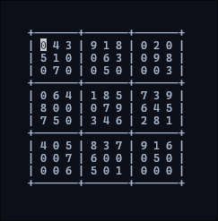

# Dokusu

A terminal Sudoku game written in Java, with a text UI built on
[Lanterna](https://github.com/mabe02/lanterna).

> **Status:** work in progress. The game is playable from start to finish,
> but the experience is still rough around the edges. See
> [Known limitations](#known-limitations).

<!-- Screenshot: game board -->


## Features

- Randomly generated, fully valid 9x9 Sudoku board every game
- Five difficulty levels
- Keyboard-only controls: move with arrows, select and confirm with Enter
- Board centered in the terminal, with the selected cell highlighted

## Rules

The board is a 9x9 grid divided into nine 3x3 boxes. Fill every empty cell
(shown as `0`) with a digit from 1 to 9 so that no digit repeats in any:

1. **row**,
2. **column**,
3. **3x3 box**.

Full rules: [RULES.md](RULES.md).

## Difficulty levels

| Level | Name                  | Empty cells |
|-------|-----------------------|-------------|
| 1     | Poczatkujacy          | 15          |
| 2     | Srednio poczatkujacy  | 20          |
| 3     | Sredni                | 30          |
| 4     | Zaawansowany          | 40          |
| 5     | Ekspert               | 50          |

## Controls

**Menu**

| Key       | Action             |
|-----------|--------------------|
| ↑ / ↓     | Choose a level     |
| Enter     | Start the game     |

**Game**

| Key              | Action                                                  |
|------------------|---------------------------------------------------------|
| ↑ ↓ ← →          | Move the cursor (wraps around the edges)                |
| Enter (on a `0`) | Start entering a digit; the cell turns yellow           |
| 1–9              | Type a digit (you can change it before confirming)      |
| Enter            | Confirm the digit                                       |
| Esc (entering)   | Cancel entering                                         |
| Esc              | Finish the game and show the result                     |

After you press Esc the game compares your board with the solution and prints
either a win message or the number of mistakes.


## Running

### Requirements

- Java 11 or newer

[Lanterna 3.1.3](https://github.com/mabe02/lanterna) is already included in
the repository as `lib/lanterna-3.1.3.jar`, so there is nothing to download.

### Command line

From the project root run:

```sh
javac -cp lib/lanterna-3.1.3.jar -d out $(find src -name "*.java")
java -cp lib/lanterna-3.1.3.jar:out Main
```

On Windows use `;` instead of `:` in the classpath.

Run it in a real terminal. Inside an IDE console Lanterna opens a separate
Swing window instead.

### IntelliJ IDEA

Open the project folder and run `Main`. The Lanterna library is already
configured and points to `lib/lanterna-3.1.3.jar`.

## Project structure

```
src/
├── Main.java               entry point
├── Game.java               game flow: menu → board → play → result
├── model/
│   └── Board.java          9x9 board storage
├── logic/
│   ├── Generator.java      generates a full valid board (backtracking)
│   ├── MakePuzzle.java     removes cells depending on the level
│   ├── Rules.java          row / column / box checks
│   └── IsSolvedCorrectly.java  counts mistakes against the solution
└── ui/
    ├── Menu.java           level selection screen
    ├── GameScreen.java     cursor, input and game loop
    └── PrintBoardL.java    draws the board with Lanterna
```

## Known limitations

The game works, but these are known issues:

- **Generation can be slow.** Most boards appear instantly, but occasionally
  generation takes several seconds (in rare cases much longer) and the screen
  looks frozen.
- **The game does not end by itself.** Nothing detects a full board; you have
  to press Esc. Empty cells left at that point count as mistakes.
- **Puzzles may have more than one solution.** Cells are removed at random,
  so on higher levels a board can be solvable in several valid ways. Your
  answer is compared with one specific solution, so a solution that follows
  every rule can still be scored as wrong.
- **Entered digits cannot be changed.** Once confirmed, a cell is locked, so a
  single typo means a mistake.
- **No live feedback.** Mistakes are only counted at the end; the result is
  printed as plain text after the game screen closes.
- **No return to the menu.** The program exits after one game.

## Roadmap

- Faster generator that skips digits already tried in a cell
- Puzzles with a unique solution
- Detect a completed board and end the game automatically
- Allow editing and clearing your own entries
- End screen inside Lanterna with an option to play again
